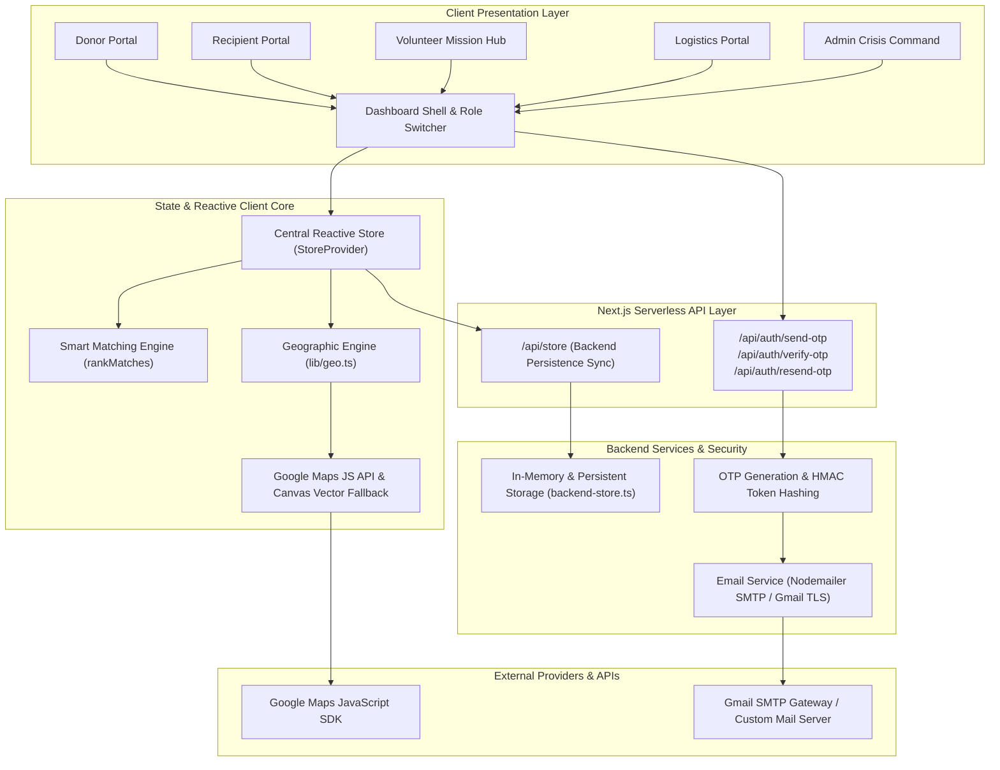
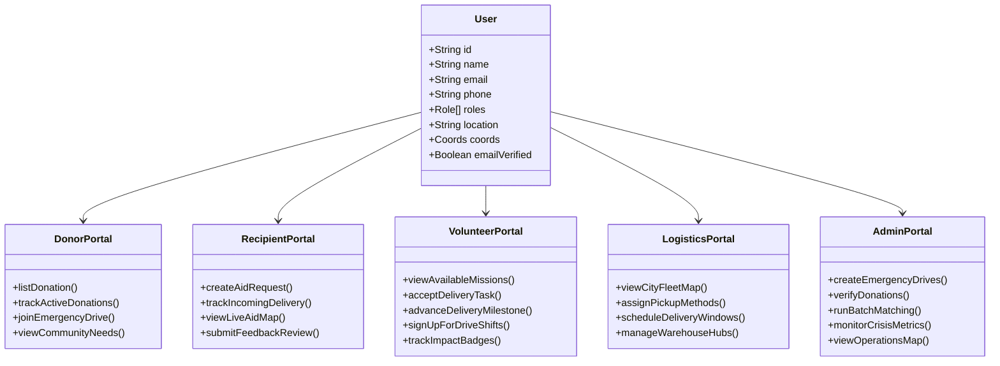
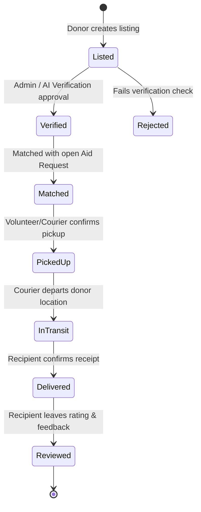
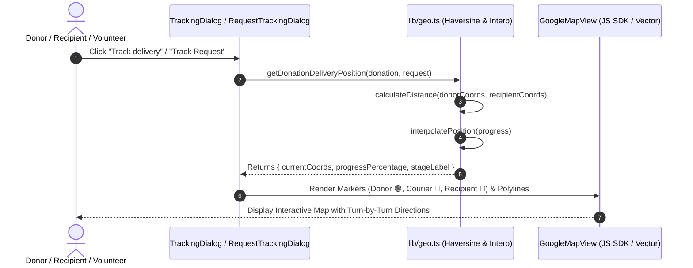
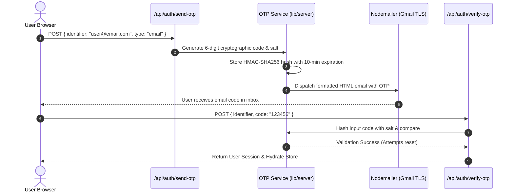
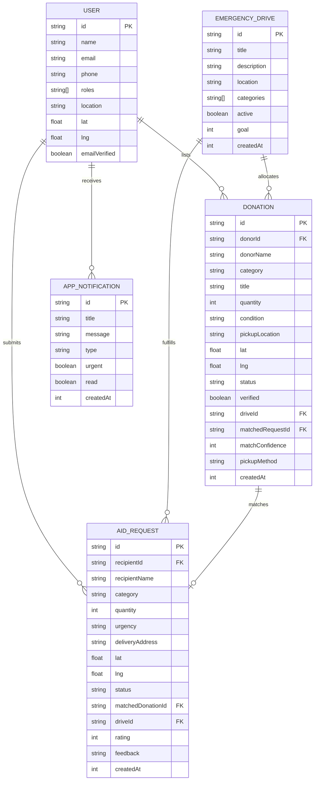

# EssentialAid — System Architecture Document
**Coordinated Humanitarian Aid, Rapid Disaster Relief & Real-Time Delivery Tracking Platform**

---

## 1. Executive Overview

**EssentialAid** is a full-stack, mission-critical humanitarian aid distribution platform engineered to coordinate crisis relief drives, surplus donor supplies, and urgent recipient requests in real time. 

The system brings together five distinct stakeholder roles—**Donors**, **Recipients**, **Volunteers**, **Logistics Coordinators**, and **Crisis Administrators**—under a unified, responsive web platform equipped with automated AI verification, intelligent proximity matching, and turn-by-turn Google Maps delivery tracking.

---

## 2. High-Level Architecture Diagram

---

## 3. Technology Stack

| Layer | Technology | Rationale |
| :--- | :--- | :--- |
| **Framework** | **Next.js 16 (App Router)** | Modern React server components, fast routing, and serverless API handlers. |
| **Frontend Core** | **React 19 & TypeScript** | Strict type safety across all donation, request, and geo-data models. |
| **Styling & UI** | **Vanilla TailwindCSS & Radix UI Primitives** | Custom high-contrast crisis-ready design system with dark mode support. |
| **Iconography** | **Lucide React** | Consistent, expressive visual language for aid categories and progress states. |
| **Mapping & GIS** | **Google Maps JavaScript API + HTML5 Canvas** | Turn-by-turn road polylines, GPS interpolation, and interactive vector fallback. |
| **Backend & APIs** | **Next.js Serverless Route Handlers** | Lightweight, zero-cold-start REST endpoints for authentication and sync. |
| **Authentication** | **Passwordless Email OTP (HMAC + SMTP)** | Secure, friction-free login without stored passwords; rate-limited and expiring. |
| **Email Delivery** | **Nodemailer + TLS SMTP** | RFC 5322 compliant transaction emails for authentication codes. |

---

## 4. Role-Based Portal Architecture

### 1. Donor Portal (`components/portals/donor-portal.tsx`)
- **Supply Ingestion**: Multi-category donation submission with photo attachments, condition tags, and quantity specifications.
- **Community Demand Map**: Visualizes open recipient needs across the region; enables 1-click supply matching.
- **Emergency Crisis Pledges**: Allows donors to allocate supplies directly to specific disaster relief funds.

### 2. Recipient Portal (`components/portals/recipient-portal.tsx`)
- **Aid Request Workflow**: Fast request submission categorized by urgency (`Normal`, `High`, `Critical`).
- **Live Request & Supply Tracker**: Real-time Google Map showing donor origin, in-motion courier GPS position, and matching algorithm status.
- **Delivery Confirmation & Review**: 5-star rating system with donor feedback logging upon delivery.

### 3. Volunteer Mission Hub (`components/portals/volunteer-portal.tsx`)
- **Mission Dispatch Map**: Interactive GIS view of open pickups and destination drop-offs with distance and estimated drive duration.
- **Status Stepper Controls**: Field actions (`Confirm Pickup` ➔ `Start Transit` ➔ `Complete Delivery`).
- **Relief Drive Shifts**: Instant sign-up for on-site sorting, warehouse staging, and emergency transport.
- **Impact & Badges**: Gamified recognition metrics (Hours Volunteered, Completed Deliveries, First Responder Honors).

### 4. Logistics Dispatch Portal (`components/portals/logistics-portal.tsx`)
- **Central Fleet Map**: Live visibility of all in-transit community couriers and regional distribution routes.
- **Milestone Advancement**: Dispatcher controls for scheduling time windows and allocating vehicle types.

### 5. Crisis Administrator Portal (`components/portals/admin-portal.tsx`)
- **Regional Operations Center**: Comprehensive map overlaying disaster zones, active drives, and pending supplies.
- **Verification Queue**: Manual and automated validation of donated goods for safety and quality compliance.
- **Automated Match Engine**: Proximity-and-urgency matching matrix.

---

## 5. Core Subsystems & Technical Workflows

### 5.1. The 6-Stage Donation Lifecycle State Machine

---

### 5.2. Smart Proximity & Urgency Matching Algorithm (`lib/matching.ts`)

The matching algorithm computes a weighted compatibility score ($S \in [0, 100]$) between every verified donation ($D$) and open aid request ($R$):

$$S = w_{\text{category}} \cdot S_{\text{category}} + w_{\text{urgency}} \cdot S_{\text{urgency}} + w_{\text{distance}} \cdot S_{\text{distance}} + w_{\text{quantity}} \cdot S_{\text{quantity}}$$

- **Category Match ($S_{\text{category}}$)**: Binary indicator ($1.0$ if exact match, $0.0$ otherwise).
- **Urgency Weighting ($S_{\text{urgency}}$)**: Critical ($1.0$), High ($0.8$), Normal ($0.5$).
- **Distance Factor ($S_{\text{distance}}$)**: Haversine distance decay $S_{\text{distance}} = \max(0, 1 - \frac{\text{distance (miles)}}{50})$.
- **Quantity Alignment ($S_{\text{quantity}}$)**: Proportional fulfillment of requested units.

---

### 5.3. Real-Time Geographic & Tracking Engine (`lib/geo.ts`)

- **Haversine Great-Circle Computation**: Accurate spatial distance calculation in miles and kilometers without external API roundtrips.
- **Route Trajectory Interpolation**: Dynamically computes intermediate GPS coordinates for moving couriers along curved Bezier trajectories based on status progress (`0%` ➔ `35%` ➔ `70%` ➔ `100%`).
- **Resilient Fallback**: Automatically activates a high-resolution canvas vector map when Google Maps API key is not configured, ensuring 100% local development uptime.

---

### 5.4. Passwordless OTP Authentication Subsystem (`lib/server/*`)

---

## 6. Entity Relationship Diagram (ERD)

---

## 7. Security, Reliability & Production Readiness

1. **Zero Password Storage**: Eliminates credential theft risks by relying purely on transient, salted HMAC OTP tokens with strict rate-limiting (max 5 attempts per window).
2. **Deterministic Role Segregation**: User sessions maintain distinct role permissions preventing unauthorized data mutations across portals.
3. **Optimized Bundle & Asset Delivery**: Zero heavy map library runtime bloat; Next.js dynamic script injection loads Google Maps asynchronously with client-side caching.
4. **Resilient Offline Architecture**: Client store state hydrations gracefully tolerate API network interruptions and restore operational records seamlessly.
